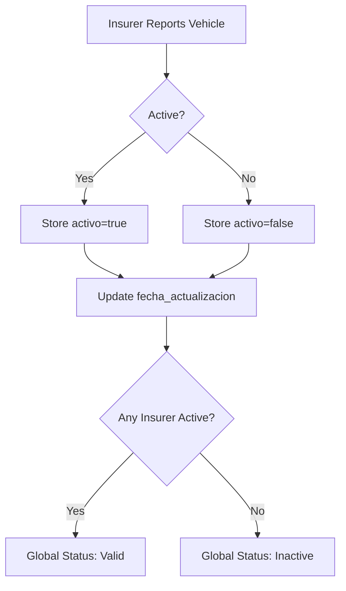
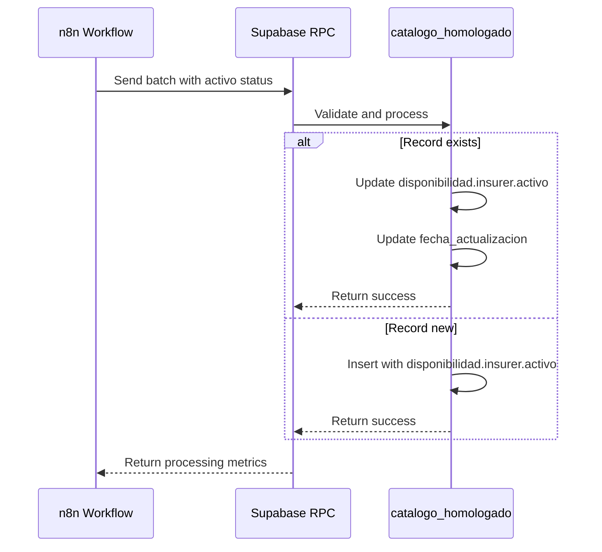
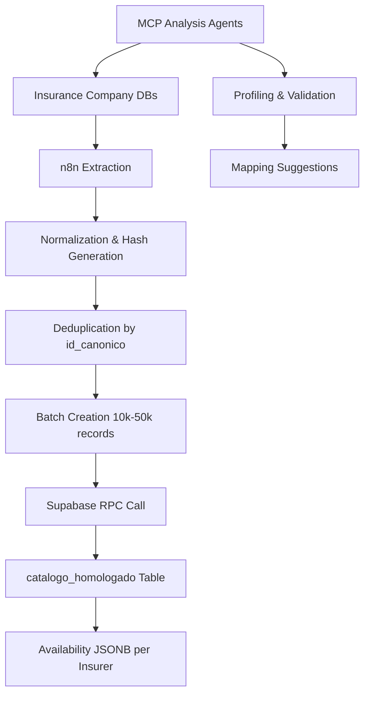

# Active/Inactive Status Management Overview

<cite>
**Referenced Files in This Document**   
- [Replanteamiento homologacion.md](file://src/supabase/Replanteamiento%20homologacion.md)
- [instrucciones.md](file://instrucciones.md)
- [WARP.md](file://WARP.md)
- [Funcion RPC Nueva.sql](file://src/supabase/Funcion%20RPC%20Nueva.sql)
- [casos de prueba función rpc.sql](file://src/supabase/casos%20de%20prueba%20función%20rpc.sql)
</cite>

## Table of Contents
1. [Introduction](#introduction)
2. [Status Definitions](#status-definitions)
3. [Implementation Details](#implementation-details)
4. [Integration with Vehicle Homologation System](#integration-with-vehicle-homologation-system)
5. [Practical Examples](#practical-examples)
6. [Troubleshooting Guidance](#troubleshooting-guidance)
7. [Conclusion](#conclusion)

## Introduction
The Active/Inactive Status Management system is a critical component of the vehicle catalog homologation process, designed to maintain accurate availability information for vehicle models across multiple insurance providers. This system tracks the active/inactive status at both the individual insurer level and the global catalog level, ensuring that the homologated vehicle catalog accurately reflects current market availability. The implementation leverages a JSONB field in PostgreSQL to store per-insurer availability data, allowing for efficient querying and updates while maintaining complete historical traceability.

**Section sources**
- [instrucciones.md](file://instrucciones.md#L1-L280)
- [Replanteamiento homologacion.md](file://src/supabase/Replanteamiento%20homologacion.md#L1-L280)

## Status Definitions

### Insurer-Level Status
The system maintains active/inactive status at the individual insurer level through the `disponibilidad` JSONB field in the `catalogo_homologado` table. Each insurer's status is stored as a nested object with the following properties:

- **Active (a nivel aseguradora)**: The insurer declares the vehicle version as currently available or offerable in their catalog. This status is stored with `activo=true` in the insurer's entry within the `disponibilidad` field.
- **Inactive (a nivel aseguradora)**: The insurer has discontinued or unpublished the vehicle offering. This status is recorded with `activo=false` while preserving the `id_original`/`version_original` values and updating the `fecha_actualizacion` timestamp.

### Global Validity Status
The global validity of a vehicle record in the homologated catalog is derived from the individual insurer statuses. A record in the `catalogo_homologado` table is considered **globally valid** if at least one insurer reports it as active (`activo=true`). This approach ensures that vehicles remain available in the unified catalog as long as they are offered by any participating insurer, providing comprehensive coverage for insurance quoting systems.



**Diagram sources**
- [Replanteamiento homologacion.md](file://src/supabase/Replanteamiento%20homologacion.md#L106-L121)

**Section sources**
- [Replanteamiento homologacion.md](file://src/supabase/Replanteamiento%20homologacion.md#L106-L121)
- [instrucciones.md](file://instrucciones.md#L106-L121)

## Implementation Details

### Data Structure
The active/inactive status is implemented using a JSONB column named `disponibilidad` in the `catalogo_homologado` table. This flexible structure allows storing availability information for multiple insurers within a single row:

```json
{
  "QUALITAS": {
    "activo": true,
    "id_original": "372340",
    "version_original": "ADVANCE 5P L4 1.5T AUT., 05 OCUP.",
    "fecha_actualizacion": "2025-01-15T10:00:00Z"
  },
  "HDI": {
    "activo": false,
    "id_original": "HDI_3787",
    "version_original": "YARIS CORE L4 5.0 SUV",
    "fecha_actualizacion": "2025-01-14T09:30:00Z"
  }
}
```

### Persistence Logic
The system follows specific persistence rules to ensure data integrity and historical accuracy:

- **No Deletion**: The RPC function never deletes rows when vehicles become inactive. Instead, it updates the `activo` flag within the `disponibilidad` JSONB field for the specific insurer.
- **Reactivation**: When an insurer that previously marked a vehicle as inactive begins offering it again, the system updates `activo=true` and refreshes the `fecha_actualizacion` timestamp.
- **Idempotency**: The RPC function `procesar_batch_homologacion` is designed to be idempotent, meaning reprocessing the same batch will not create unintended changes to status information.

### Update Process
When processing vehicle data batches, the system follows this sequence for status management:

1. Validate incoming data contains required fields including `activo` status
2. Perform upsert operation based on `id_canonico`
3. Merge the JSONB `disponibilidad` field for the source insurer, updating:
   - `activo` status
   - `id_original` and `version_original` 
   - `fecha_actualizacion` to current timestamp
4. Preserve availability information for all other insurers
5. Update the row's `fecha_actualizacion` timestamp



**Diagram sources**
- [Funcion RPC Nueva.sql](file://src/supabase/Funcion%20RPC%20Nueva.sql#L1-L429)

**Section sources**
- [Replanteamiento homologacion.md](file://src/supabase/Replanteamiento%20homologacion.md#L106-L121)
- [Funcion RPC Nueva.sql](file://src/supabase/Funcion%20RPC%20Nueva.sql#L1-L429)

## Integration with Vehicle Homologation System

### Data Flow Integration
The active/inactive status management is tightly integrated into the overall vehicle homologation workflow, which follows this sequence:



During the normalization phase in n8n, the `activo` status is determined based on each insurer's data model. For example, HDI uses `Activo = 1` to indicate active records, while other insurers may use different conventions that are normalized to boolean values.

### RPC Function Integration
The `procesar_batch_homologacion` function serves as the primary integration point between the ETL process and the status management system. This function:

- Accepts a JSONB array of vehicle records containing the `activo` status
- Processes each record to update the availability status in the homologated catalog
- Returns metrics on the processing results, including counts of updated records

The function is accessible via PostgREST at the endpoint `/rest/v1/rpc/procesar_batch_homologacion` with appropriate authentication headers.

### Querying Availability
The system provides multiple ways to query vehicle availability:

```sql
-- Find all active vehicles for a specific brand/model
SELECT marca, modelo, anio, version, aseguradoras_activas
FROM vehiculos_maestro 
WHERE marca = 'TOYOTA' 
  AND modelo = 'YARIS'
  AND 'QUALITAS' = ANY(aseguradoras_activas);

-- Get availability by insurer
SELECT marca, modelo, anio,
       disponibilidad_aseguradoras->'QUALITAS'->>'activo' as qualitas_activo,
       disponibilidad_aseguradoras->'HDI'->>'activo' as hdi_activo
FROM catalogo_homologado
WHERE marca = 'TOYOTA' AND modelo = 'COROLLA';
```

**Diagram sources**
- [WARP.md](file://WARP.md#L152-L203)

**Section sources**
- [WARP.md](file://WARP.md#L152-L203)
- [instrucciones.md](file://instrucciones.md#L1-L280)

## Practical Examples

### Example 1: Initial Vehicle Ingestion
When a new vehicle is first processed from an insurer's catalog:

```sql
-- Initial insertion from Qualitas
SELECT public.procesar_batch_homologacion(
  jsonb_build_object('vehiculos_json', '[
    {
      "id_canonico": "a7a8fbec4e5bed8535f19ab418fe9bb83bda4eb4d26058eb0e2d2b9218069221",
      "hash_comercial": "98d9e4baceb9ed37cbe3e24512c24e62cb30b125a2d25cbb27348468340990b2",
      "marca": "TOYOTA",
      "modelo": "YARIS",
      "anio": 2014,
      "transmision": "AUTO",
      "version": "PREMIUM",
      "carroceria": "SEDAN",
      "origen_aseguradora": "QUALITAS",
      "id_original": "Q-123456",
      "version_original": "PREMIUM SEDAN 1.5L AUTO",
      "activo": true
    }
  ]'::jsonb)
);
```

This creates a new record with Qualitas marked as active.

### Example 2: Insurer Discontinuation
When an insurer discontinues a vehicle model:

```sql
-- Zurich marks vehicle as inactive
SELECT public.procesar_batch_homologacion(
  jsonb_build_object('vehiculos_json', '[
    {
      "id_canonico": "a7a8fbec4e5bed8535f19ab418fe9bb83bda4eb4d26058eb0e2d2b9218069221",
      "hash_comercial": "98d9e4baceb9ed37cbe3e24512c24e62cb30b125a2d25cbb27348468340990b2",
      "marca": "TOYOTA",
      "modelo": "YARIS",
      "anio": 2014,
      "transmision": "AUTO",
      "version": "PREMIUM",
      "carroceria": "SEDAN",
      "origen_aseguradora": "ZURICH",
      "id_original": "Z-789",
      "version_original": "PREMIUM 1.5L SEDAN",
      "activo": false
    }
  ]'::jsonb)
);
```

This updates only the Zurich entry in the `disponibilidad` field, setting `activo=false` while preserving other data.

### Example 3: Cross-Insurer Status Comparison
Querying to compare availability across insurers:

```sql
-- Check availability status across multiple insurers
SELECT 
    marca, 
    modelo, 
    anio,
    disponibilidad->'QUALITAS'->>'activo' as qualitas_status,
    disponibilidad->'HDI'->>'activo' as hdi_status,
    disponibilidad->'ZURICH'->>'activo' as zurich_status
FROM catalogo_homologado
WHERE id_canonico = 'a7a8fbec4e5bed8535f19ab418fe9bb83bda4eb4d26058eb0e2d2b9218069221';
```

This query might return a vehicle that is active with Qualitas and HDI but inactive with Zurich, resulting in a globally valid status.

**Section sources**
- [casos de prueba función rpc.sql](file://src/supabase/casos%20de%20prueba%20función%20rpc.sql#L0-L68)

## Troubleshooting Guidance

### Common Issues and Solutions

#### Issue 1: Unexpected Status Changes
**Symptom**: Vehicles showing as inactive despite being available in insurer catalogs.

**Diagnosis**: 
- Verify the ETL process is correctly extracting the `activo` status from the source
- Check for data type mismatches in the normalization process
- Confirm the batch processing is not failing silently

**Resolution**:
1. Review the insurer-specific analysis files (e.g., `hdi-analisis.md`) for correct status mapping
2. Validate the normalization code is properly converting source status indicators to boolean values
3. Check processing logs for warnings or errors during batch execution

#### Issue 2: Inconsistent Global Validity
**Symptom**: Vehicles appearing as inactive in the global catalog despite being active with one or more insurers.

**Diagnosis**:
- Verify the global validity logic is correctly implemented in views or queries
- Check for issues with JSONB path expressions when accessing `disponibilidad` data
- Ensure all insurer entries are being properly updated

**Resolution**:
1. Validate the query logic for determining global validity:
   ```sql
   -- Correct approach to check global validity
   SELECT * FROM catalogo_homologado ch
   WHERE EXISTS (
       SELECT 1 FROM jsonb_each(ch.disponibilidad) 
       WHERE (value->>'activo')::boolean = true
   );
   ```
2. Test with sample data to confirm the logic works as expected
3. Verify that the `aseguradoras_activas` array in `vehiculos_maestro` is being properly generated

#### Issue 3: Status Not Persisting
**Symptom**: Status updates are not being saved or are being overwritten.

**Diagnosis**:
- Check for race conditions in concurrent batch processing
- Verify the RPC function is properly merging JSONB data rather than replacing it
- Confirm the `ON CONFLICT` clause is correctly handling updates

**Resolution**:
1. Review the RPC function logic for JSONB merging:
   ```sql
   -- Ensure disponibilidad is merged, not replaced
   disponibilidad = ch.disponibilidad || jsonb_build_object(
       t.origen_aseguradora, jsonb_build_object(
           'activo', t.activo,
           'id_original', t.id_original,
           'version_original', t.version_original,
           'fecha_actualizacion', NOW()
       )
   )
   ```
2. Implement proper error handling and logging
3. Test with concurrent batches to ensure idempotency

### Monitoring and Validation
Regular monitoring should include:

- **Status Coverage**: Ensure all source records have appropriate active/inactive status
- **Consistency Checks**: Validate that status changes align with insurer catalog updates
- **Processing Metrics**: Monitor batch processing results for unexpected patterns
- **Data Quality**: Track the completeness of status information across all insurers

**Section sources**
- [WARP.md](file://WARP.md#L317-L413)
- [casos de prueba función rpc.sql](file://src/supabase/casos%20de%20prueba%20función%20rpc.sql#L0-L68)

## Conclusion
The Active/Inactive Status Management system provides a robust framework for tracking vehicle availability across multiple insurance providers within the homologation process. By maintaining insurer-level status in a flexible JSONB structure while deriving global validity from these individual statuses, the system ensures accurate representation of market availability. The implementation prioritizes data preservation over deletion, allowing for historical tracking of availability changes while supporting efficient querying for insurance quoting systems. Proper integration with the ETL pipeline and careful attention to the idempotent processing design ensure reliable and consistent status management across the vehicle catalog.